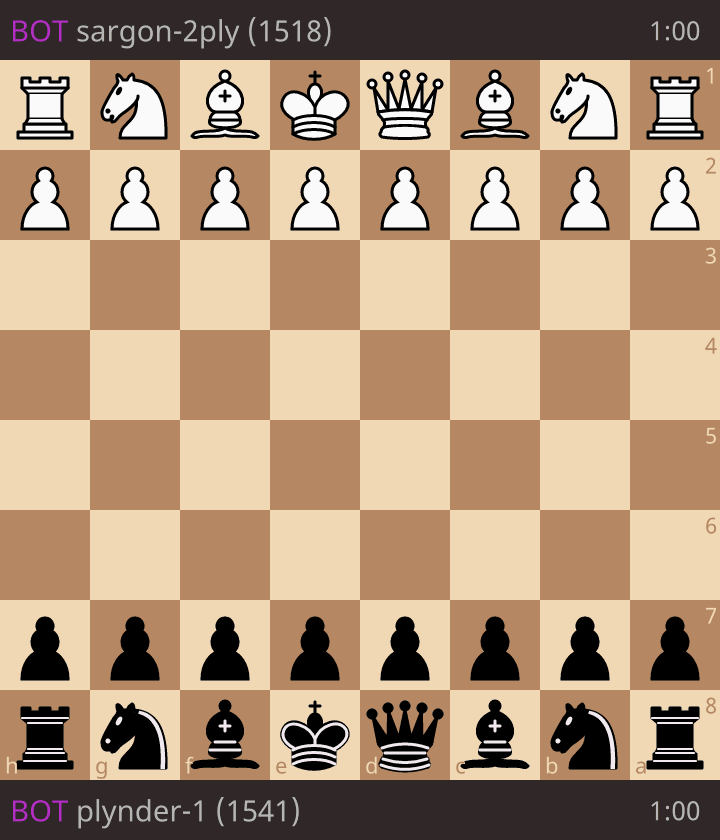
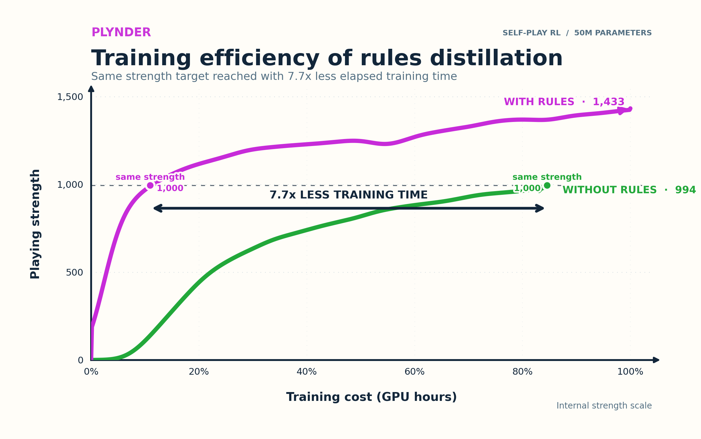
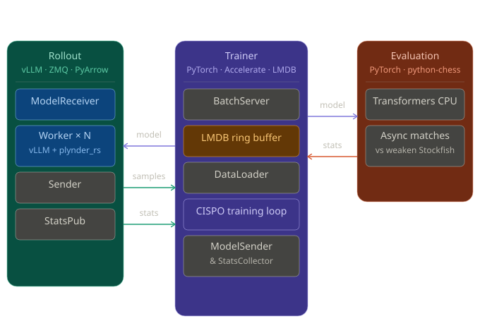

# Plynder

[](LICENSE)
[](https://www.python.org/)
[](rust_extension/)
[](https://huggingface.co/aLocks/Plynder-1)

> **A distributed reinforcement-learning system for training language models to play chess through self-play.**
>
> *A plunder of plies.*

Plynder is an open-source asynchronous RL training system for chess language models.
It represents chess as a 1,972-token action space and trains policies from
self-play outcomes using CISPO with group-relative advantages.

Rollout workers use vLLM together with a Rust chess engine that constrains
sampling to legal moves. **Training**, **rollout**, and **evaluation** run independently
and communicate asynchronously through ZeroMQ, with LMDB providing persistent
trajectory buffering.

<p align="center">
  
</p>

## Quick start

From the repository root, install the dependencies and build the Rust extension:

```bash
uv sync
```

Download Stockfish for evaluation:

```bash
mkdir -p stockfish
curl -fsSL https://github.com/official-stockfish/Stockfish/releases/download/sf_18/stockfish-ubuntu-x86-64-avx2.tar \
  -o /tmp/stockfish.tar
tar -xf /tmp/stockfish.tar --strip-components=1 -C stockfish \
  stockfish/stockfish-ubuntu-x86-64-avx2
chmod +x stockfish/stockfish-ubuntu-x86-64-avx2
rm /tmp/stockfish.tar
```

The opening book is committed, so no generation step is required. In three
terminals, run the entry points from the repository root:

```bash
# Terminal 1: training
uv run accelerate launch --config_file configs/accelerate.yaml src/plynder/train/main.py

# Terminal 2: rollout
uv run python src/plynder/rollout/main.py

# Terminal 3: evaluation
uv run python src/plynder/evaluation/main.py
```

For a multi-host setup, set `networking.train_ip` in `configs/config.yaml` to
the trainer's address before starting rollout and evaluation.

## Results

As a reference experiment, we trained a 50M-parameter model with Plynder.

It reaches **1,433** on Plynder's Stockfish-calibrated internal strength
scale, and reached approximately **1,550 Bullet Elo**
when deployed on Lichess.


| Reference run | Rules distillation | Final ranking | Trainer tokens | Rollout tokens | Lichess Bullet |
|---|---|---:|---:|---:|---:|
| Plynder-1 | Enabled | **1,433** | 255.2B | 178.4B | **~1,550** |
| Ablation | Disabled | 994 | 227.0B | 145.9B | — |

The internal ranking is an Elo-like metric calibrated against Stockfish using
4,096-game evaluations.

### Rules distillation efficiency

<p align="center">
  
</p>

In the matched Plynder-1 experiment, rules distillation reaches the final
strength of the no-rules run with **7.7× less elapsed training time**.

## Why Plynder?

Plynder treats chess as a constrained language-model RL problem rather than a
supervised move-imitation problem.

The system combines:

- **CISPO** with group-relative advantages
- legal-action-constrained generation inside vLLM
- a high-performance **Rust chess engine**
- **rules distillation** from legal-move masks
- distributed **rollout**, **training**, and **evaluation**
- ZeroMQ communication and LMDB trajectory persistence


## Architecture



See the [architecture documentation](docs/architecture.md) for a detailed system description.

| Process | Role |
|---|---|
| **Rollout** | Generates self-play trajectories with vLLM while the Rust engine constrains sampling to legal moves. |
| **Training** | Computes group-relative advantages, optimizes the policy with CISPO and optional rules distillation, and broadcasts updated weights. |
| **Evaluation** | Evaluates model snapshots against calibrated Stockfish opponents and reports model ranking. |

Trajectories are serialized with PyArrow and persisted through an LMDB ring
buffer. Model updates and trajectory transport use ZeroMQ.

## How it works

### Move token space

Every chess move maps to a deterministic token ID.

The vocabulary contains **1,972 tokens**:

- 1,968 sorted UCI move tokens
- BOS
- DRAW
- WHITE_WIN
- BLACK_WIN

A game is represented as a sequence of move tokens terminated by a result token.

At every generation step, the Rust engine compute the legal moves of 
the current position, and injects the corresponding action mask into vLLM 
to mask illegal `logits` before the sampling `softmax`.
The rollout policy therefore cannot sample an illegal chess move.
The rust engine is asynchronous and its computation is overlapped with vLLM prefile/decode.

### CISPO training

For each opening position, rollout generates a group of continuations,
defaulting to 16.

Advantages are computed relative to other trajectories in the group, separately
for white and black. The policy is optimized using **CISPO
(Clipped Importance-Sampling weight Policy Optimization)**.

Plynder also implements the CISPO Eq. 7 importance-sampling mask, which removes
gradients from over-confident good actions and abandoned bad actions.

See [src/plynder/train/losses.py](src/plynder/train/losses.py).

### Rules distillation

A lightweight auxiliary head attached to an intermediate model layer learns to
predict legal actions from intermediate hidden states.

It is trained through KL divergence against legal-move masks produced by the
Rust engine, providing a dense rules-learning signal alongside the sparse
game-outcome objective.


### Rust legal-move engine

The extension in [rust_extension/](rust_extension/) contains the
performance-critical chess logic:

- **sequences_states_pool.rs**: board states, legal moves, terminal detection,
  and GPU-ready masks
- **utils.rs**: token ↔ UCI mappings and insufficient-material detection
- **repetition_tracker.rs**: threefold repetition tracking
- **writer.rs**: trajectory serialization

The integration in
[src/plynder/rollout/vllm_plugin/0_18_1/](src/plynder/rollout/vllm_plugin/0_18_1/)
injects legal-action masks directly into vLLM's sampling path.

## Released models

| Model | Description | Model card |
|---|---|---|
| **Plynder-1** | First public reference run, trained with CISPO and rules distillation | [Hugging Face](https://huggingface.co/aLocks/Plynder-1) |